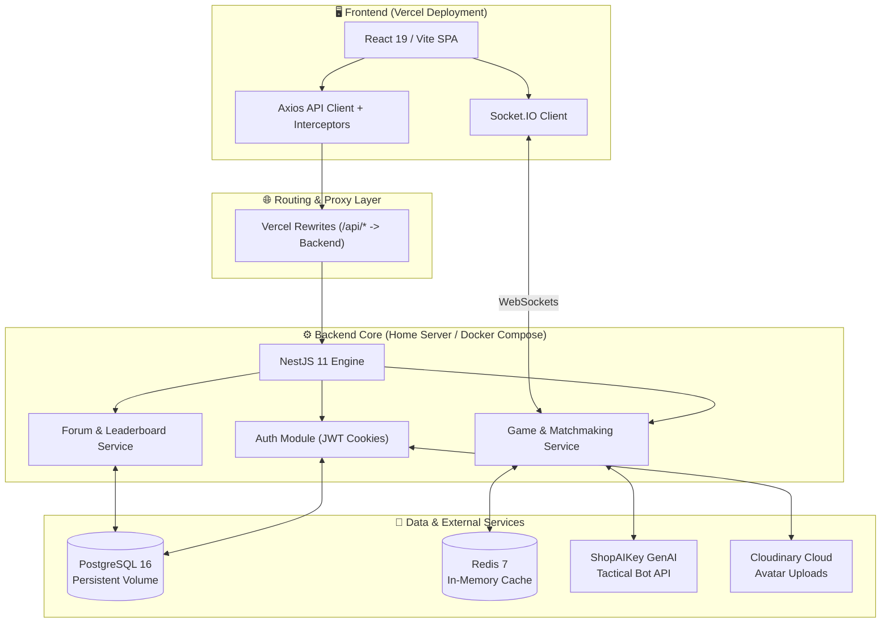

<div align="center">
  <h1>⚓ BATTLESHIP ONLINE: TACTICAL ARENA</h1>
  <p><b>Nền tảng Hải chiến Chiến thuật Trực tuyến Đa nền tảng — Xây dựng theo Triết lý X - Y - Z</b></p>
  <p>
    
    
    
    
    
  </p>
</div>

---

## 🧭 Triết lý Cốt lõi X - Y - Z (The X - Y - Z Philosophy)

Dự án **Battleship Online** được thiết kế, phát triển và tối ưu hóa dựa trên công thức cấu trúc giá trị kỹ thuật cao cấp: **Đạt được mục tiêu [X], được đo lường bằng kết quả [Y], thông qua việc áp dụng công nghệ/phương pháp [Z]** (*Accomplished **[X]** as measured by **[Y]**, by doing **[Z]***).

```
   +-----------------------------------------------------------------------------------+
   |  [X] BÀI TOÁN & TẦM NHÌN (THE GOAL)                                               |
   |  Xây dựng đấu trường hải chiến chiến thuật thời gian thực, đa chế độ, mượt mà.    |
   +-----------------------------------------------------------------------------------+
                                            │
                                            ▼
   +-----------------------------------------------------------------------------------+
   |  [Y] KẾT QUẢ ĐO LƯỜNG (THE METRICS)                                               |
   |  • Đồng bộ realtime với độ trễ < 50ms & khả năng tự khôi phục (Auto-reconnect).   |
   |  • An toàn kiểu dữ liệu 100% (Type-Safe) từ Frontend đến Backend & Database.      |
   |  • Zero-downtime CI/CD tự động hoàn toàn trên Home Server & Docker Compose.       |
   +-----------------------------------------------------------------------------------+
                                            │
                                            ▼
   +-----------------------------------------------------------------------------------+
   |  [Z] GIẢI PHÁP & CÔNG NGHỆ (THE TECH STACK)                                       |
   |  • React 19 + Vite + Motion + Lucide + i18n (Frontend HUD hiện đại).              |
   |  • NestJS 11 + Socket.IO + TypeORM + PostgreSQL 16 + Redis 7 (Backend Core).      |
   |  • Tích hợp GenAI (ShopAIKey) + Cloudinary API + Self-Hosted GitHub Runner.       |
   +-----------------------------------------------------------------------------------+
```

---

## ✨ Điểm nhấn Kiến trúc theo Mô hình X - Y - Z

### 1. ⚔️ Đấu trường Trực tuyến Thời gian thực (Real-time Online PvP)
* **[X] Mục tiêu:** Loại bỏ hoàn toàn tình trạng giật lag, mất đồng bộ hay sai lệch trạng thái bàn cờ giữa hai người chơi trong các trận đấu đối kháng căng thẳng.
* **[Y] Kết quả:** Đạt phản hồi nước bắn tức thì, duy trì kết nối ổn định với cơ chế tự động kết nối lại (`Auto-reconnect`) trong vòng 5 giây khi đứt đường truyền, hỗ trợ tùy biến kích thước lưới (`Rows x Cols`) và theo dõi trạng thái phòng (`Waiting`, `Setup`, `In-game`, `Finished`).
* **[Z] Giải pháp:** Xây dựng hệ thống giao tiếp qua **WebSockets (`Socket.IO 4`)** kết hợp bộ nhớ đệm tốc độ cao **`Redis 7`** để lưu trữ trạng thái trận đấu (Match State), quản lý luồng sự kiện song song và cách ly tác vụ xử lý IO.

### 2. 🤖 Trí tuệ Nhân tạo & Giả lập Chiến thuật (GenAI Tactical Bot & Bot vs Bot)
* **[X] Mục tiêu:** Cung cấp trải nghiệm luyện tập đơn (PvE) thách thức và môi trường mô phỏng chiến thuật tự động không cần người chơi thật.
* **[Y] Kết quả:** Tạo ra đối thủ AI có tư duy phán đoán tọa độ tàu thông minh, cùng chế độ giả lập độc đáo **`Bot vs Bot`** cho phép hai AI tự động giao đấu với độ chính xác và tốc độ cao để phân tích chiến thuật.
* **[Z] Giải pháp:** Tích hợp trực tiếp **`ShopAIKey GenAI API`** vào tầng kiến trúc dịch vụ game (`game.service.ts`) của **`NestJS 11`**, kết hợp thuật toán tính toán xác suất vùng biển.

### 3. 🏆 Hệ thống Xếp hạng & Huy hiệu Độc quyền (Elo Ranking & Rank Tiers)
* **[X] Mục tiêu:** Vinh danh kỹ năng và sự cống hiến của người chơi trên bảng vàng danh giá.
* **[Y] Kết quả:** Hệ thống tính điểm Elo chuẩn xác chia thành 5 bậc hàm uy lực từ *Thủy thủ học việc* đến *Chúa tể đại dương*, hiển thị huy hiệu động (Dynamic Badges) và danh sách Top chỉ huy ngay trên trang chủ.
* **[Z] Giải pháp:** Đồng bộ hóa dữ liệu qua `TypeORM` trên **`PostgreSQL 16`**, kết hợp thuật toán phân cấp `getRankTierId(elo)` và tối ưu truy vấn bảng xếp hạng thời gian thực.

### 4. 💬 Diễn đàn Cộng đồng & Quản trị Hệ thống (Community Forum & RBAC Moderation)
* **[X] Mục tiêu:** Xây dựng cộng đồng chia sẻ chiến thuật lành mạnh và bộ máy quản trị mạnh mẽ.
* **[Y] Kết quả:** Cho phép người chơi thảo luận, bình luận, bình chọn (`Upvote / Downvote`) các bài viết hấp dẫn. Phân quyền chặt chẽ (`ADMIN`, `MOD`, `USER`) với khả năng xử lý vi phạm tức thì (`Ban / Unban`).
* **[Z] Giải pháp:** Sử dụng mô hình quan hệ cơ sở dữ liệu mạnh mẽ trong PostgreSQL và hệ thống **Interceptors/Guards** của NestJS/Axios tự động vô hiệu hóa Token và ngắt kết nối khi phát hiện tài khoản bị cấm.

---

## 🏗️ Sơ đồ Kiến trúc Hệ thống



---

## 🛠️ Công nghệ Sử dụng (Tech Stack)

| Thành phần | Công nghệ | Mô tả vai trò |
| :--- | :--- | :--- |
| **Frontend Core** | `React 19`, `Vite`, `TypeScript` | Xây dựng giao diện Single Page Application (SPA) tốc độ cao, mượt mà. |
| **Giao diện & Hiệu ứng** | `Tailwind CSS 4`, `Vanilla CSS`, `Motion` | Hệ thống Design Tokens, Glassmorphism, Micro-animations và HUD mang phong cách tương lai. |
| **Backend Core** | `NestJS 11`, `Node.js 20` | Kiến trúc Modular Monolith mạnh mẽ, chuẩn Enterprise, khả năng mở rộng cao. |
| **Real-time Engine** | `Socket.IO 4` | Giao tiếp hai chiều độ trễ cực thấp cho Game Rooms & Chat. |
| **Cơ sở dữ liệu** | `PostgreSQL 16` (`TypeORM`) | Lưu trữ bền vững dữ liệu Người dùng, Trận đấu, Lịch sử và Bài viết cộng đồng. |
| **Bộ nhớ đệm (Cache)** | `Redis 7` (`ioredis`) | Quản lý Match State trong RAM, hạn chế tải cho DB và tăng tốc truy xuất. |
| **Bảo mật (Security)** | `JWT`, `bcrypt`, `Secure Cookies` | Cơ chế Access/Refresh Token với HttpOnly Cookie an toàn tuyệt đối. |
| **AI & Media API** | `ShopAIKey GenAI`, `Cloudinary` | Xử lý AI cho Bot chiến thuật và lưu trữ hình ảnh đại diện người chơi. |
| **CI/CD & DevOps** | `Docker Compose`, `GitHub Actions` | Triển khai tự động bằng Self-Hosted Runner trực tiếp trên Home Server. |

---

## 🚀 Hướng dẫn Triển khai & Cài đặt (Getting Started)

### 1. Yêu cầu hệ thống
- **Node.js** `>= 20.x`
- **Docker & Docker Compose** (Nếu chạy trọn bộ Production/Container)
- **PostgreSQL 16** & **Redis 7** (Nếu chạy trực tiếp trên môi trường Local)

### 2. Cài đặt Môi trường Phát triển (Local Development)

#### Bước 1: Clone kho lưu trữ
```bash
git clone https://github.com/nkdkhtl/battleship-game.git
cd battleship-game
```

#### Bước 2: Cài đặt và khởi chạy Backend (NestJS Server)
```bash
cd server
npm install

# Sao chép file biến môi trường và cấu hình DB/Redis của bạn
cp ../.env.production.example .env

# Chạy Database Migrations & Seeding dữ liệu Admin ban đầu
npm run migration:run
npm run seed

# Khởi chạy server ở chế độ phát triển (Cổng mặc định: 3000)
npm run start:dev
```

#### Bước 3: Cài đặt và khởi chạy Frontend (React Client)
```bash
cd ../client
npm install

# Khởi chạy giao diện Vite Dev Server
npm run dev
```
Truy cập vào giao diện web tại: `http://localhost:5173`

---

## 🐳 Triển khai Production với Docker Compose & Self-Hosted Runner

Dự án được tích hợp sẵn luồng CI/CD hoàn chỉnh trong `.github/workflows/deploy.yml`. Để vận hành hệ thống ngầm 24/7 trên Home Server:

1. **Cấu hình biến môi trường (`Secrets & Variables`) trên GitHub Repository:**
   Đảm bảo các biến như `DB_NAME`, `DB_PASSWORD`, `JWT_SECRET`, `CLIENT_URL` và `DB_SYNCHRONIZE=false` được khai báo đầy đủ.
2. **Cài đặt GitHub Actions Runner dưới dạng Service (`svc.sh`):**
   ```bash
   cd ~/actions-runner
   sudo ./svc.sh install
   sudo ./svc.sh start
   ```
3. **Mỗi khi Push code lên nhánh `main`:**
   Workflow sẽ tự động build image Docker lên **GitHub Container Registry (GHCR)**, pull về Home Server, chạy migration, tự động khởi động lại `postgres`, `redis`, `server` mà không làm gián đoạn trải nghiệm người chơi!

---

## 📜 Giấy phép (License)
Dự án được phát triển cho mục đích học tập và xây dựng cộng đồng.
## Đóng góp (Contribute)
Dự án được thực hiện bởi [nkdkhtl](https://github.com/nkdkhtl) - [zunohoang](https://github.com/zunohoang) - [N4Marco](https://github.com/N4Marco)